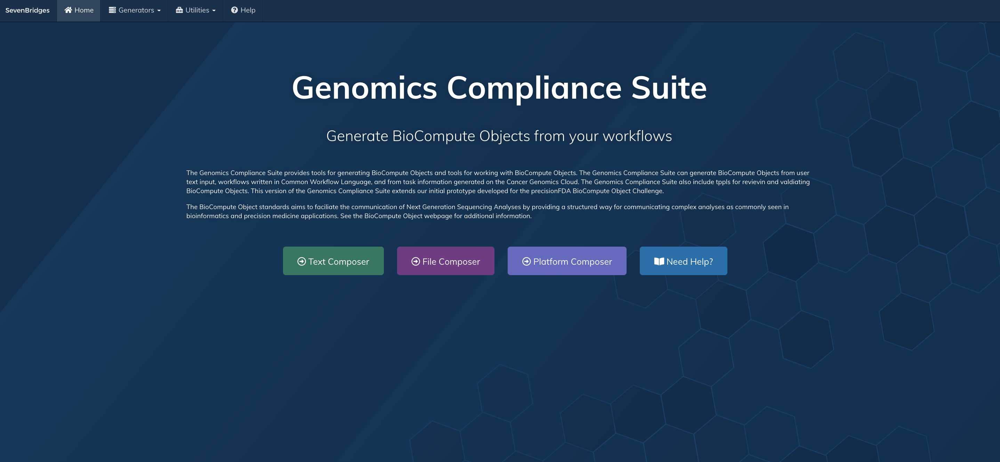
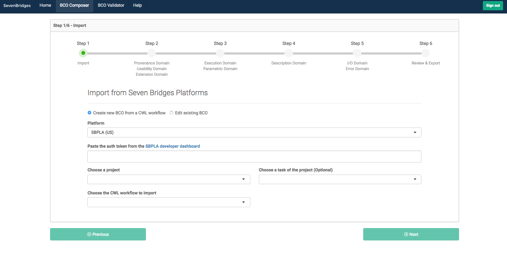
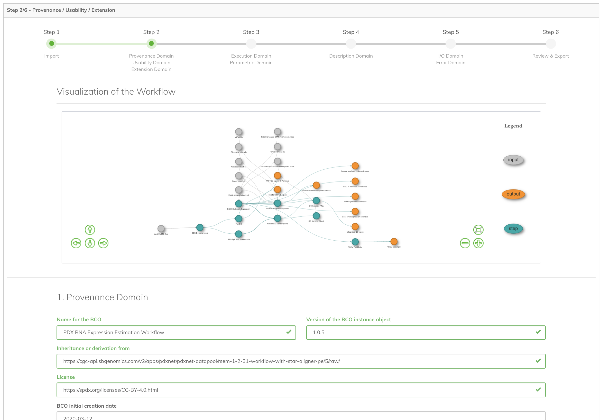
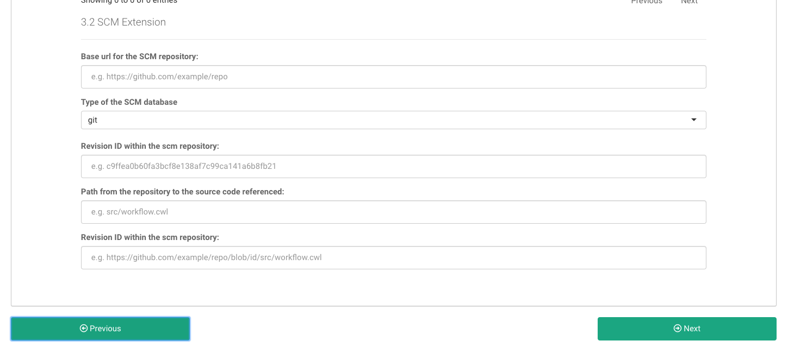
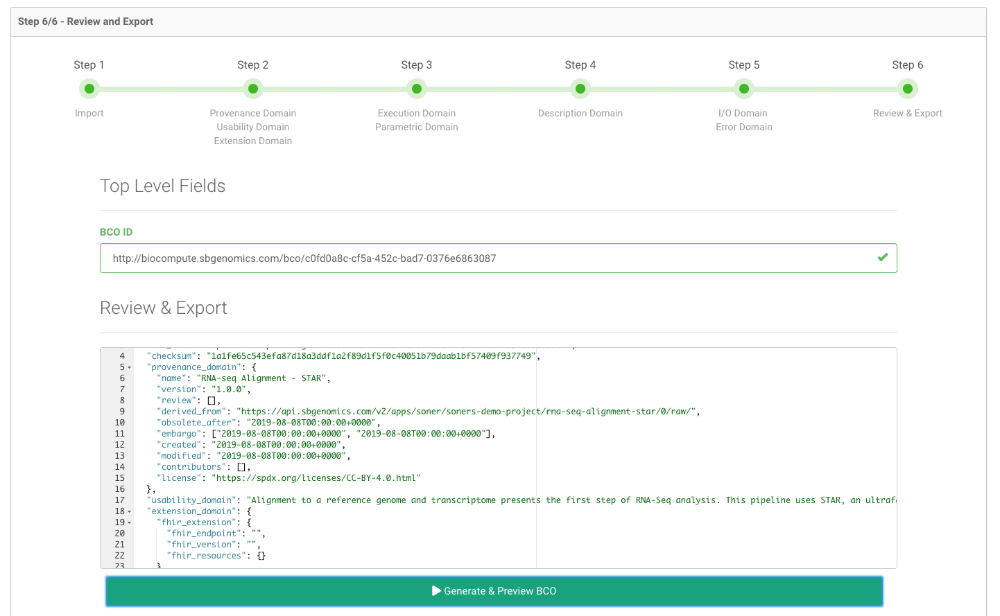
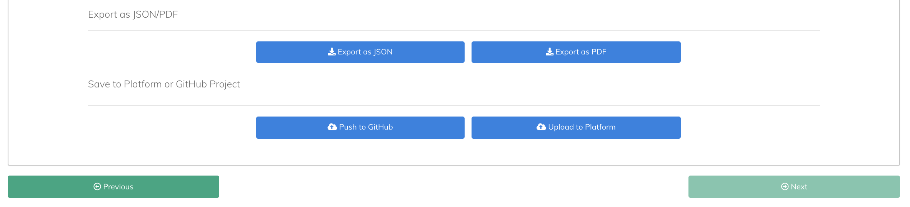
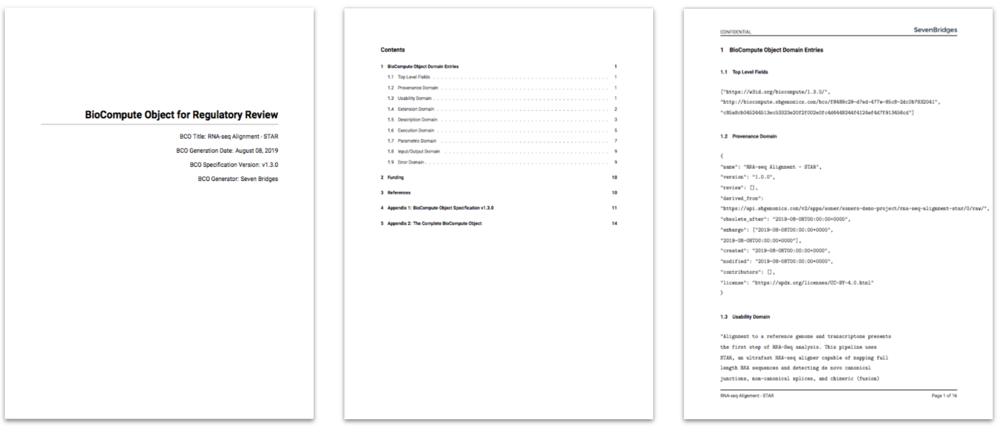
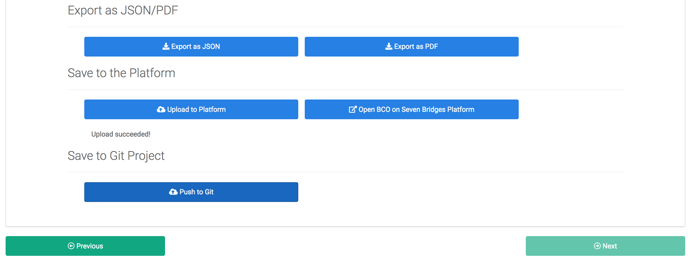
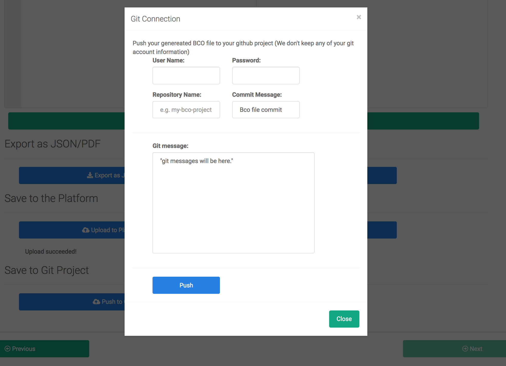
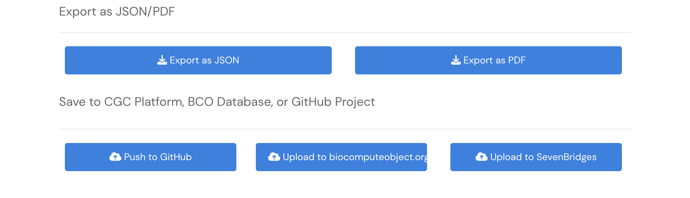

# Introduction {#goals}

The BCO App provides tools for generating, reviewing, and validating BioCompute Objects (BCOs). The BCO App can generate BioCompute Objects from user text input, workflows written in Common Workflow Language (CWL), and from CWL and task information generated on the Cancer Genomics Cloud. The BCO App also includes tools for reviewing and validating BioCompute Objects stored locally or on the cloud. Our goals in providing the BCO App are to encourage further development of the BCO standard, promoting the use of CWL to document complex bioinformatics workflows, and to facilitate the use of BCOs in operational settings; including developing the application to support FDA regulatory submissions.

This user manual provides a brief introduction into BioCompute Objects, instructions for installing BCO App, and an overview of BCO App features.

In reviewing the user manual you will learn how to:

-   Generate BCOs from text or CWL files
-   Generate BCOs from CWL workflows or Task information from your Seven Bridges Platform project
-   Download generated BCO JSON file to your local machine
-   Generate PDF reports from BCO JSON files
-   Upload BCO file to any of the Seven Bridges platforms
-   Publish BCOs to your GitHub account.

# BioCompute Objects {#getting-started}

The BioCompute Object standard is an emerging standard that aims to facilitate the communication of Next Generation Sequencing (NGS) analyses by providing a structured way for documenting and communicating complex analyses as commonly seen in bioinformatics and precision medicine applications. The BCO standard defines 33 fields across nine domains (ex. identification and execution domains). The BCO JSON file is designed to be both human and machine readable. BCO App supports BioCompute specification v1.3.0. See the appendix or the [BioCompute Object website](https://biocomputeobject.org) for additional details.

## BCO App Overview {#login}

The current version of the BCO App expands upon our initial prototype developed for the precisionFDA BioCompute Object Challenge. The precisionFDA challenge required the submitted tools to support the display, creation, and validation of BCOs. Our current tool also includes support for selecting inputs from both your local machine and from files stored on the Cancer Genomics Cloud, as well as selecting inputs from the suite of Seven Bridges Platforms. BCO App supports interactive as well as semi-automated BCO construction. For example, you have the option to select a CWL workflow on the CGC as a way to pre-populate workflows-related BCO fields.

## Menu Options

The following menu options are available from the BCO App:

| **Menu Entry**    | **Description**                                                                                                                                                                                                      |
|-------------|----------------------------------------------------------|
| **Home**          | App landing page with links to generators and help screen                                                                                                                                                            |
| **Generators**    | Tools for generating BCO JSON Files, generating a BCO PDF, and publishing BCO to a GitHub page                                                                                                                       |
| Text Composer     | Interface allows users to interactively enter text into BCO fields. The composer steps the user through completing each of the BCO domains.                                                                          |
| CWL Composer      | Interface allows a user to select a CWL file from their local machine to pre-populate the BCO fields with workflow related fields. Once loaded, the interface is identical to the Text Composer.                     |
| Platform Composer | Interface allows a user to select a CWL Workflow or Task on the Cancer Genomics Cloud to pre-populate the BCO fields with workflow/task related fields. Once loaded, the interface is identical to the Text Composer |
| **Utilities**     | Tools that support BCO use.                                                                                                                                                                                          |
| Browser           | The browser facilitates interactive review of a BCO JSON file                                                                                                                                                        |
| Validator         | The validator allows a user to compare a BCO JSON file to the BCO specification.                                                                                                                                     |
| Standard          | The Standard feature provides an interface to review the BCO field definitions by domain.                                                                                                                            |
| **Help**          | Brief description of Menu items                                                                                                                                                                                      |

## Installing and Accessing the BCO App

The BCO App can be deployed locally and on a remote server. Both the source code and a containerized (Docker) version are available on GitHub. The source code can also be executed from the Cancer Genomics Cloud, as well as any of the Seven Bridges Platforms, through the R Studio extension on our platforms. Additional BCO App deployment details are explained below.

### Containerized app {#docker}

Running BCO App from a containerized app will allow you to execute the app without having to install BCO App requirements/dependencies on your local machine or server (Figure 1). Instructions for pulling, building, and running the Docker image can be found in the [BCO App GitHub repo](https://github.com/sbg/bco-app). The default username and password are both: `sevenbridges`.

### Cancer Genomics Cloud hosted app {#hosted}

The BCO App can be executed from within the Cancer Genomics Cloud through RStudio, as explained in each section below.

**Getting the app**

Copy the 'biocompute-composer.zip' to your project folder. Please request access to the zip file if you do not currently have access (support.at.sbgenomics.com).

**Running the app**

To run the app:

-   Click "Interactive Analysis", then open "Data Cruncher".

-   Click "Create your first analysis", select "RStudio" and start the analysis.

-   When the editor is launched, switch to the "Terminal" tab in the lower left panel, run the following commands to copy the app from the project to the analysis session:

    ``` bash
    cp /sbgenomics/project-files/biocompute-composer.zip /sbgenomics/workspace/
    unzip -q /sbgenomics/workspace/biocompute-composer.zip
    rm /sbgenomics/workspace/biocompute-composer.zip
    ```

-   Go to the biocompute-composer folder in the files panel (lower right), open and run through the code in app-setup.R to setup the environment (use Ctrl + Enter to run the code line-by-line).

-   Open app.R, click the "Run App" button in the code editor panel to run the app.

-   A dialog about popup windows may appear if you're running this for the first time, click "Try Again" to proceed.

-   Note: if running the app from a restarted analysis session, remember to run app-setup.R again before running the app.

## Getting Started with the BCO App {#start-page}

Executing the BCO App will result in an optional login page or the BCO App landing page depending on the BCO App settings.

### Login Page (Deployment Specific)

The login credentials are installation dependent. The default login credentials for both username and password is: sevenbridges

### Landing Page

You will see the landing page of the BCO App after you log in:



The navigation bar along the top of the screen provides access to primary BCO App features including Generators and Utilities. Button along the bottom of the screen provide single-click access to BCO App BCO generators and to the BCO App help screen.

## Generating BioCompute Objects with BCO App

The following example details generating a BCO from a CWL workflow on the Cancer Genomics Cloud. We selected this example because the Platform Composer includes elements of the text composer and the CWL composer. Reading through the example will outline the steps required to generate a BCO object.

### Platform Composer {#composer}

### Step 1 - Import the Target CWL App {#import-cwl}

After you click the "**Platform Composer**" page of the BCO App under the "**Generators**" tab, you will see the initial step of the BCO generation, the Import step:



The BCO Creator/Composer includes six steps, each step corresponding to a BCO domain, to generate a new BioCompute Object (BCO):

Step 1: Import workflow written Common Workflow Language (CWL).

Step 2: Set BCO fields in the Provenance, Usability, and Extension Domains.

Step 3: Set BCO fields in the Execution and Parametric Domains.

Step 4: Set the Description Domain fields.

Step 5: Set the fields in the I/O and Error Domain.

Step 6: Generate BCO

Once user entry is completed, you can generate and review the BCO associated with the workflow. A generated BCO can be downloaded, published to a Git page, and uploaded to your Seven Bridges platform.

This first Import step (Figure 3) collects the following information from you to initiate the generation process: **Platform**, **Authentication Token**, **Project**, **Task of the Project** (optional), and **Application Name**. Select a name for a **Platform** that you want to fetch a CWL file of an application.


After that, paste your authentication token to "**Paste the auth token from...**" field. Colored text in the name of the field is a direct link to the authentication token page of the selected platform (See **Appendix I** for additional information). Projects, tasks, and applications that exist in the account of the user will be fetched once a valid authentication token is entered. Finally, the target application can be selected from "**Choose the CWL workflow to import**" field to fetch a CWL of a target application to work with to generate a BioCompute Object. Optionally, a user could selected an completed task at this step which would include the workflow information in the generated CWL.

### Step 2 - Provenance, Usability, and Extension Domains {#provenance}

In step 2, User enters Provenance, Usability, and Extension Domains of BCO.

The BCO App automatically enters some fields from information parsed from the selected CWL workflow. Users are prompted to complete the remaining fields. You can find the complete detailed list of Provenance, Usability, and Extension Domain fields in **Appendix II**. See Figure 4 and 5 for Provenance Domain Entry fields.





### Step 3 - Execution and Parametric Domains {#execution}

In step 3, You are prompted to enter text in the Execution and Parametric Domains fields. Some entries will spark a pop up box as shown in Figure 6. See **Appendix II** for a complete list of fields in the Execution and Parametric Domain.


### Step 4 - Description Domain {#description}

The user is prompted to enter information from the in the Description Domain. Some of the fields will be pre-populated as shown in Figure 7. See **Appendix II** for a complete list Description Domain fields.


You can find the complete list of the details of the Description Domain fields in Appendix II and Table 5.

### Step 5 - I/O and Error Domain {#io-error}

Next, you are prompted to enter information for the I/O and Error Domains. Some of the fields will be pre-populated as shown in Figure 8 and 9 below. You can find the complete detailed list of I/O and Error Domains' fields in **Appendix II**.


You can find the complete detailed list of I/O and Error Domains' fields in Appendix II, Table 8, and Table 9.

### Step 6 - Review and Export {#export}

As the last step of BCO Composer, you can review your generated BCO file in "**Review & Export**" after "**Generate & Preview BCO**" button is clicked. The **BCO ID** of the generated BCO file is automatically assigned:



The BCO App includes several BCO export features (Figure 11). A user can export a BCO file in JSON file format, "**Export as JSON**". The generated BCO file is downloaded as a JSON file (Figure 12).




Users can also generate a PDF reports for the BioCompute Object with "**Export as PDF**" button. The report includes human readable summaries for all the BCO domains, the BioCompute Object specification, and the raw JSON of the generated BCO:



In addition to export features, there are two very useful save features in the BCO App: **Save to the Platform** and **Save to GitHub**.

The first one is **Save to the Platform**, automatically saves the generated BCO file into "**BCO**" folder under "**Files**" of your project. You can see the example of the generated files in the project's "**Files/BCO**" folder in Figure 14.

Also, there is no need to open the platform in the external browser window. When "**Save to the Platform**" button is clicked, the direct link (to the platform) appears near the "**Upload Succeeeded**" warning to access the generated file on the platform easily (Figure 15).




A second way to save the generated BCO is to publish the BCO to GitHub. "**Save to GitHub**", automatically saves the generated BCO file into your GitHub account. "**GitHub Connection**" popup window streamlines the process of publishing the BCO JSON file to your git page (Figure 16).

The **GitHub Connection** popup window requires the **username** and **password** of the user's GitHub account to complete the connection and push operations. The user also enters the target **Repository Name** to push the generated BCO file. The **Git Commit Message** contains GitHub response messaged that may include indication of a successful or failed operation.



\clearpage

## BioCompute Object Utilities

### BioCompute Object (BCO) Validator {#validator}

The BCO validator checks an uploaded BCO JSON file with the BCO specification. Results of the check include a Checksum Validation and the Schema Validation.


\clearpage

### Interactive BCO Browser {#browser}

The Interactive browser allows the user to open and review a BCO file stores on a local machine:


\clearpage

# Appendix I : Platform Authentication Guide {.unnumbered}

This section describes how to authenticate and access your Seven Bridges platform resources via the API token.

## Authentication Token {.unnumbered}

Your authentication token encodes your Seven Bridges Platform credentials and uniquely identifies you on the Seven Bridges Platform. It can be used with a number of API and automation features of the Seven Bridges Platform without the need of a manual, GUI authentication process.

## Locate Authentication Token {.unnumbered}

You can get your authentication token from the developer dashboard. For example, for Seven Bridges Platform users, click [here](https://igor.sbgenomics.com/developer#token) to go to the developer dashboard to generate a new token or access your token:


\clearpage

# Appendix II: BioCompute Object Domains {.unnumbered}

This section summarizes the domains defined in the BioCompute Object specification (v1.3.0).

## Top Level Field {.unnumbered}

| Name                         | ID                 | Description                                                                                                                     |
|-------------|-------------|----------------------------------------------|
| BCO version                  | bco_spec \_version | The version of the BCO specification used to define the BCO.                                                                    |
| BioCompute Object Indetifier | BCO_id             | Unique identifier that should be apllied to each BCO instance. Assigned by a BCO database engine, like URL. It never be reused. |
| Checksum                     | checksum           | A string-type, read-only value, protecting the object from internal or external alterations without proper validaiton.          |

\clearpage

## Provenance Domain {.unnumbered}

| Name                    | ID             | Description                                                                                                                                                                                                                 |
|---------------|---------------|-------------------------------------------|
| Name                    | name           | Name of the BCO.                                                                                                                                                                                                            |
| Version                 | version        | Records the versioning of this BCO instance object. A change in the BCO affecting the outcome of the computation should be deposited as a new BCO, not as a new version.                                                    |
| Review                  | review         | Describes the status of an object in the review process. Status flags: unreviewed, in-review, approved, suspended, rejected.                                                                                                |
| Inheritance /derivation | derived from   | If the object is derived from another, this field will specify the parent object, in the form of the objectid. It is null, if inherits only from the base BioCompute Object or a type definition.                           |
| Obsolescence            | obsolete       | If the object has an expiration date this field will specify that using the datetime type.                                                                                                                                  |
| Embargo                 | embargo        | If the object has a period of time that it is not public, that range can be specified using these fields. Using the datetime type a start and end time are specified for the embargo.                                       |
| Created                 | created        | Using the datetime type the time of initial creation of the BCO is recorded.                                                                                                                                                |
| Modification            | modified       | Using the datetime type the time of most recent modification of the BCO is recoded.                                                                                                                                         |
| Contributors            | contributors . | List to hold contributor identifiers and a description of their type of contribution, including a field for ORCIDs to record author information, as they allow for the author to curate their information after submission. |
| License                 | license        | A space for Creative commons licence or other licence information. The default or recommended licence can be Attribution 4.0 International.                                                                                 |

\clearpage

## Usability Domain {.unnumbered}

| Name             | ID                 | Description                                                                                                                                                                                                                                                  |
|-----------|-----------|---------------------------------------------------|
| Usability Domain | usability \_domain | Provides a space for the author to define the usability domain of the BCO. It is an array of free text values. This field is to aid in search-ability and provide a specific description of the object. It helps determine when and how the BCO can be used. |

## Extension Domain {.unnumbered}

| Name                                                     | ID                                                       | Description                                                                                                                                                                         |
|----------------|----------------|----------------------------------------|
| Extension Domain                                         | extension \_domain                                       | For a user to add more structured information that is defined in the type definition. This section is not evaluated by checks for BCO validity or computational correctness.        |
| Extension to External References: SMART on FHIR Genomics | Extension to External References: SMART on FHIR Genomics | SMART on FHIR Genomics provides a framework for HER-based apps to built on FHIR that integrate clinical and genomics information.                                                   |
| Extension to External References: GitHub                 | Extension to External References: GitHub                 | Include an extension to GitHub repositories where HTS computational analysis pipelins, workflows, protocols, and tool or software source code can be stored, deposited, downloaded. |

\clearpage

## Description Domain {.unnumbered}

| Name                   | ID                   | Description                                                                                                                                                                                                                                                                                                     |
|----------------|----------------|----------------------------------------|
| Description Domain     | description \_domain | Structured field for description of external references, the pipeline steps, and the relationship of IO objects. Information in this domain is not used for computation. Capture information that is currently being provided in FDA submission in journal format.                                              |
| Keywords               | keywords             | List of key map fields to hold a list of keywords to aid in search-ability and description of the object.                                                                                                                                                                                                       |
| External References    | xref                 | It contains a list of the databases and/or ontology IDs that are cross-referenced in the BCO. It provides more specificity in the information related to BCO entries.                                                                                                                                           |
| Platform  /Environment | platform             | The multi-value reference to a particular deployment of an existing platform where this BCO can be reproduced (Galaxy or HIVE or CASAVA).                                                                                                                                                                       |
| Pipeline tools         | pipeline \_steps     | For recording the specifics of a pipeline. Each individual tool is represented as step, at the discretion of the author. Step Number (step_number), Name (name), Tool Description (description), Tool Version (version), Tool Prerequisites (prerequisite), Input List (input_list), Output List (output_list). |

\clearpage

## Execution Domain {.unnumbered}

| Name                                         | ID                         | Description                                                                                                                                                                                                                                                                                                                                             |
|-------------|-------------|-----------------------------------------------|
| Execution Domain                             | execution \_domain         | The filelds required for execution of the BCO have been encapsulated together in order to clearly separate information needed for deployment, software configuration, and running applications in a dependent enviroment.                                                                                                                               |
| Script                                       | script                     | Points to an internal or external reference to a script object that was used to perform computations for this BCO instance. This may be reference to Galaxy Project or Seven Bridges Genomics pipeline, a Common Workflow Language (CWL) object in GitHub, HIVE computational service or any other type of script.                                      |
| Script Driver                                | script \_driver            | The reference to an executable that can be launched in order to perform a sequence of commands described in the script. For example if the pipeline is driven by a HIVE script, the script driver is the hive execution engine. For CWL based scripts specify cwl-runner. Another very general commonly used in Linux based operating systems is shell. |
| Algorithmic tools and Software Prerequisites | software \_prerequisites   | Field listing the minimal necessary prerequisites, library, tool versions needed to successfully run the script to produce BCO.                                                                                                                                                                                                                         |
| External Data Endpoints                      | external_data \_endpoints  | An optional multi-value field listing the minimal necessary domain specific external data source access in order to successfully run the script to produce BCO.                                                                                                                                                                                         |
| Enviromental Variables                       | environment \_variables    | This is an array of key-value pairs useful to configure the execution enviroment on the target platform.                                                                                                                                                                                                                                                |

\clearpage

## Parametric Domain {.unnumbered}

| Name              | ID                    | Description                                                                                                                                                                                                   |
|---------------|---------------|------------------------------------------|
| Parametric Domain | parametric \_domain   | List of parameters customizing the computational flow which can affect the output of the calculations. These fields are custom to each type of analysis and are tied to a particular pipeline implementation. |

## Input Output Domain {.unnumbered}

| Name                    | ID                 | Description                                                                                                                             |
|-----------------|-----------------|-------------------------------------|
| Input and output Domain | io_domain          | This represents the list of global input and output files created by the computational workflow, excluding the intermediate files.      |
| Input Subdomain         | input \_subdomain  | This field records the references and input files for the entire pipeline. Each type of input file is listed under a key for that type. |
| Output Subdomain        | output \_subdomain | This field records the outputs for the entire pipeline .                                                                                |

## Error Domain {.unnumbered}

| Name                                          | ID             | Description                                                                                                                                                                                                                                                                                                                                                                                                                                                                                                                                                                                                                                                                                                                                                                                                                                                                                                             |
|----------|----------|-----------------------------------------------------|
| Error Domain, acceptable range of variability | error \_domain | Consists of two subdomains: empirical and algorithmic. The empirical subdomain contains the limits of detectability fps, fns, statistical confidence of outcomes, etc. The algorithmic subdomain is descriptive of errors that originated by fuzziness of the algorithms, driven by stochastic processes, in dynamically parallelized multi-threaded executions, or in machine learning methodologies where the state of the machine can affect the outcomeConsists of two subdomains: empirical and algorithmic. The empirical subdomain contains the limits of detectability FPs, FNs, statistical confidence of outcomes, etc. The algorithmic subdomain is descriptive of errors that originated by fuzziness of the algorithms, driven by stochastic processes, in dynamically parallelized multi-threaded executions, or in machine learning methodologies where the state of the machine can affect the outcome. |

# Uploading BioCompute Objects to the BCO Database {#database}

The user can also export their BCO directly to the biocompute database on [biocomputeobject.org](biocomputeobject.org). At the bottom of the "**Review & Export**" after the BCO is generated by the "**Generate & Preview BCO**" button click the "**Upload to biocomputeobject.org**" button. In the pop up window copy your CGC token generated according to [Appendix I: Platform Authentication Guide - Locate Authentication Token](https://sbg.github.io/bco-app/locate-authentication-token.html).



Enter the "**BCO Prefix**"; the "**BCO Schema**" which has a prefilled default; and the registered "**BCO Owner Group**" on biocomputeobject.org you'd like to push the BCO to. Click the "**Push**" button and look for the successful return message.

You can go directly to [biocomputeobject.org](biocomputeobject.org) by clicking the "**Open biocomputeobject.org**" button to view your BCO. Once signed into the website search by your BCO Owner Group for the name of your BCO or just by the group and sort by recent.
